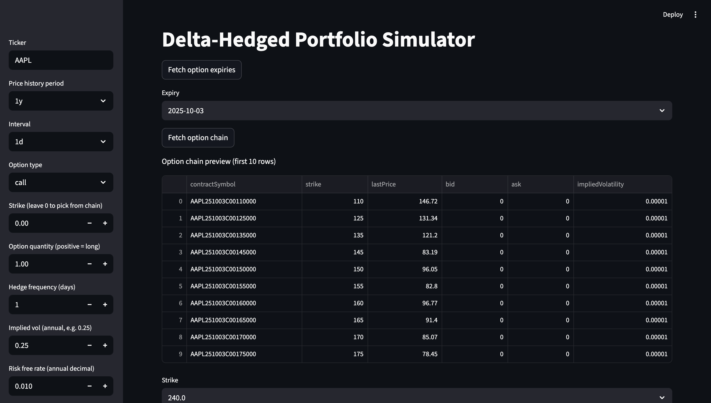
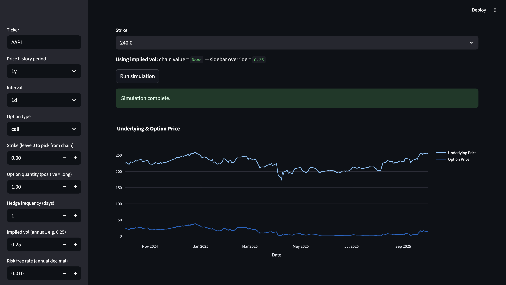
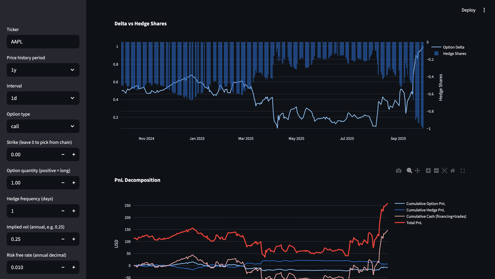
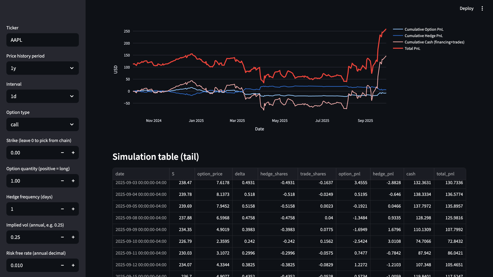

# Delta-Hedged Portfolio Simulator

This repository contains a **Streamlit dashboard** and Python library to simulate **delta-hedged option positions** using real option chains from Yahoo Finance (`yfinance`).

---

## 📌 Features

- Fetch option chains and underlying history via **yfinance**
- **Black–Scholes pricing and Greeks** for European options (vectorized)
- **Pathwise delta-hedge simulator** that rebalances at configurable frequency
- **PnL decomposition**:
  - Option value change
  - Hedge trading PnL
  - Financing carry
- Interactive **Streamlit dashboard** with controls and Plotly charts

---

## 📂 Project Structure

```bash
delta-hedged-portfolio-simulator/
│
├── config/                 # Configuration files
│   └── config.yaml
│
├── scripts/                # Utility scripts
│   └── run_local.sh
│
├── src/
│   ├── analytics/          # Future analytics (risk metrics, Greeks aggregation)
│   ├── dashboard/          # Streamlit dashboard
│   │   └── streamlit_app.py
│   ├── data/               # Data fetching from Yahoo Finance
│   ├── greeks/             # Black–Scholes and Greeks calculations
│   ├── simulator/          # Delta-hedge simulation logic
│   └── utils/              # Helper functions
|   
│
├── tests/                  # Unit tests
│   ├── test_greeks.py
│   └── test_simulator.py
│
├── simulator_screenshots/                # (Optional) Plots & screenshots saved here
│
├── LICENSE
├── requirements.txt
└── README.md
```

## ⚙️ Installation
- Clone the repository
```bash
git clone <repository-url>
cd delta-hedged-portfolio-simulator
```
- Set up virtual environment
```bash
python3 -m venv .venv
source .venv/bin/activate
```

- Install dependencies
```bash
pip install -r requirements.txt
```

## ▶️ Run the Dashboard
```bash
streamlit run src/dashboard/streamlit_app.py
```

Then open your browser at:
```bash
http://localhost:8501
```
## 🔧 Changeable Parameters

- You can adjust parameters directly from the Streamlit sidebar:

- Price history period (1y, 6mo, etc.)

- Interval (1d, 1h)

- Option type (call / put)

- Strike selection (or auto-pick from option chain)

- Option quantity (long/short)

- Hedge frequency (days between rebalancing)

- Implied volatility (override or use chain values)

- Risk-free rate (annualized)

## 📊 Example Results


- Option Chain Preview

- Underlying vs options

- Delta Hedge vs Shares

- Delta-Hedging Simulation

## 🔮 Extensions

- Gamma/Theta visualization for hedging costs

- Multiple option strategies (straddles, spreads)

- Connect to IBKR API for real execution-ready simulation

- Add Sharpe ratio, max drawdown analytics


